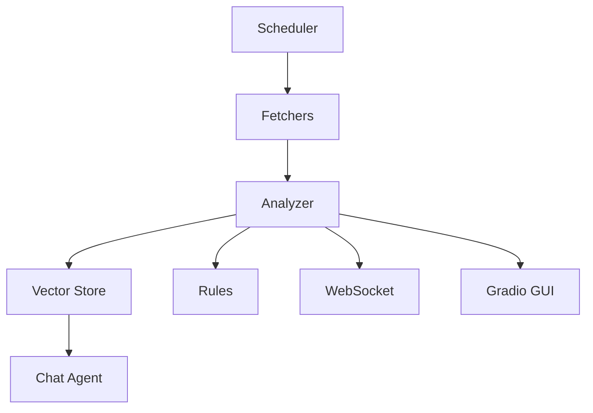
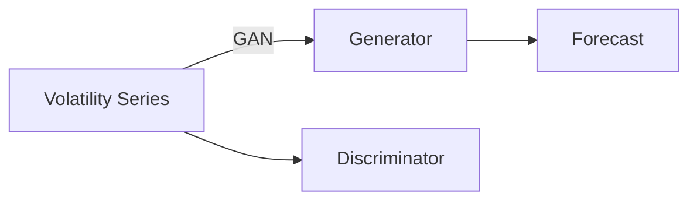
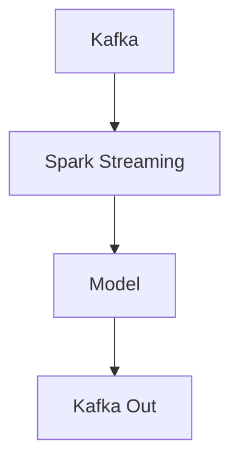
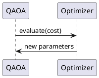

# BRGSentimentbot

Async sentiment and volatility bot featuring RSS and NewsAPI scraping,
transformer-based analysis and optional web interfaces.

> **Requires Python 3.11–3.13.**

## Quickstart

### Poetry
```bash
pip install -U poetry
poetry lock   # regenerate lockfile after dependency change
poetry install --no-root
poetry run bot once
```

### Troubleshooting
- **No articles fetched?** Create `rss_sources.txt` in the repo root with one RSS URL per line, or set `RSS_SOURCES_FILE=/path/to/feeds.txt`.
- **Interactive mode?** `poetry run bot interactive` lets you choose regions, topics, and time frames; supports `all` or comma-separated numbers.
- **Optional deps missing?** Features like chat/FAISS/LangChain are optional; the core CLI works without them.

### Config
- `RSS_SOURCES_FILE` (optional): path to a text file with RSS URLs.
- Default feeds: BBC World, Reuters World (baked-in fallback).

### Docker
```bash
docker build -t brg-bot .
docker run --rm brg-bot
```

### Simple Python

For a minimal, offline demonstration without installing dependencies:


For a minimal, offline demonstration without Poetry or Docker:

```bash
pip install aiohttp feedparser beautifulsoup4 rich

python run_simple.py
```

### Devcontainer
A simple `devcontainer.json` is provided for VS Code Remote Containers.

## CLI Usage
```bash
poetry run bot live            # continuous mode
poetry run bot once            # single cycle
poetry run bot chat            # interactive REPL
poetry run bot interactive     # select regions/topics/time
poetry run bot rules           # list loaded rules
poetry run bot simulate        # run Monte Carlo simulation
poetry run bot serve           # start websocket server
poetry run bot web             # websocket + gradio GUI
```

## Architecture


### Components
- **scheduler.py** – orchestrates periodic jobs and triggers fetchers.
- **fetcher.py** and **newsapi_client.py** – retrieve articles from RSS feeds and the NewsAPI.
- **analyzer.py** – runs sentiment and volatility analysis using embeddings, forecasting, and Bayesian modules.
- **vector_store.py** – stores embeddings and supports similarity search with FAISS.
- **chat_agent.py** – chat interface over the stored knowledge.
- **rules.py** – defines alerting rules to drive automation.
- **ws_server.py** and **gui.py** – optional WebSocket and Gradio interfaces for real-time interaction.

## Research Methodology

### Forecasting Architecture


### Streaming Topology


### Quantum Optimiser


### Causal Inference
The Bayesian module supports counterfactual queries by sampling from the
posterior predictive distribution and contrasting interventions.

### Privacy & Fairness
- Differential privacy decorator `dp_mechanism`
- Bias reports can be generated with templates in `docs/privacy_template.md`

## License

Proprietary License Agreement
