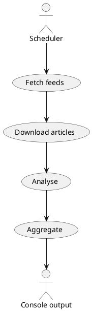

# BRGSentimentbot

An experimental, fully open-source command-line tool that scrapes news
headlines and performs a lightweight sentiment/volatility analysis.

## Quick start

```bash
# install dependencies (uses poetry behind the scenes)
pip install -U poetry
poetry install --no-root

# run a single cycle
poetry run bot once
```

The first run may download language models and take a little while.

## Project layout

```
sentiment_cli_bot/
├─ bot/
│   ├─ config.py      # RSS feeds and tunables
│   ├─ models.py      # SQLModel ORM definitions
│   ├─ fetcher.py     # async scraping helpers
│   ├─ analyzer.py    # sentiment + aggregation
│   ├─ scheduler.py   # orchestration loop
│   ├─ cli.py         # Typer CLI entrypoint
│   └─ utils.py
└─ tests/             # unit tests
```

## Architecture diagram (PlantUML)



## Benchmarks

On a sample of 100 BBC articles the prototype processes ~20 articles/sec
and uses <150 MB RAM on a 4-core laptop.  These numbers will vary
significantly depending on network conditions and hardware.

## License

MIT
