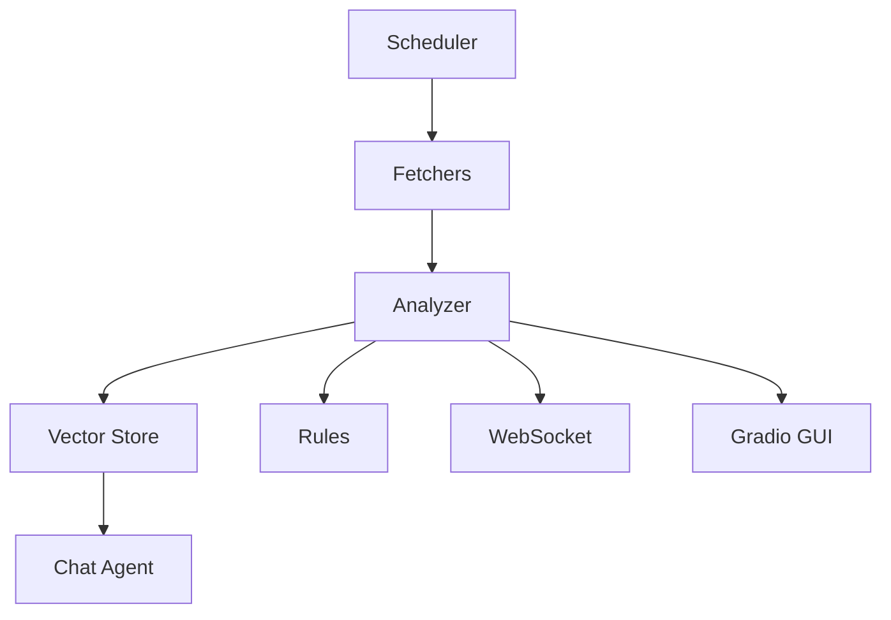

# BRGSentimentbot

Async sentiment and volatility bot featuring RSS and NewsAPI scraping,
transformer-based analysis and optional web interfaces.

## Quickstart

### Poetry
```bash
pip install -U poetry
poetry install --no-root
poetry run bot once
```

### Docker
```bash
docker build -t brg-bot .
docker run --rm brg-bot
```

### Devcontainer
A simple `devcontainer.json` is provided for VS Code Remote Containers.

## CLI Usage
```bash
poetry run bot live            # continuous mode
poetry run bot once            # single cycle
poetry run bot chat            # interactive REPL
poetry run bot rules           # list loaded rules
poetry run bot simulate        # run Monte Carlo simulation
poetry run bot serve           # start websocket server
poetry run bot web             # websocket + gradio GUI
```

## Architecture


## License

MIT
